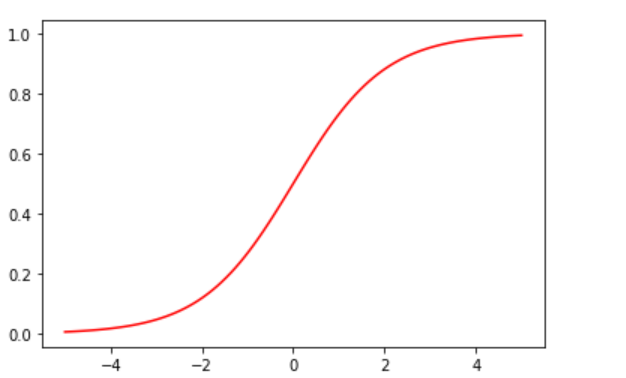
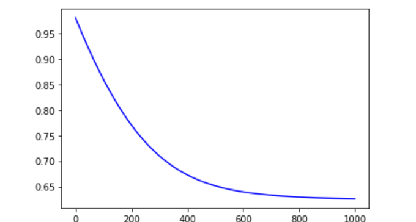
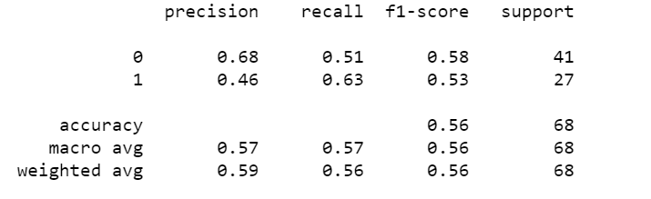

# machineLearning
A bunch of different machine learning models
Created while learning machine and deep learning techniques

List of current models:

**Regression Practice** is a linear regression using Swedish Auto Insurance Dataset involves predicting the total payment for all claims in thousands of Swedish Kronor, given the total number of claims.
The data set looks like:

After a short number of iterations, it is clear my cost function had significantly decreased and converged.

The results were very good:

**Logistic Regression Practice** is a logistic classifier predicting the likelihood of the onset of diabetes within 5 years in Pima Indians given medical details. There are 8 features and 764 examples.

The data is harder to visualise as a result.

The features are 
Number of times pregnant.
Plasma glucose concentration a 2 hours in an oral glucose tolerance test.
Diastolic blood pressure (mm Hg).
Triceps skinfold thickness (mm).
2-Hour serum insulin (mu U/ml).
Body mass index (weight in kg/(height in m)^2).
Diabetes pedigree function.
Age (years).

I used a vectorised approach with a sigmoid function:

My implementation did learn over time:

Here is my results:

